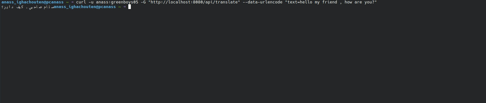

# 🌐 Darija Translator Application

Une application de traduction intelligente utilisant l'IA pour convertir du texte entre la Darija (dialecte marocain) et d'autres langues. Ce projet combine une architecture backend robuste avec plusieurs interfaces clients.

## 🚀 Fonctionnalités
* **Traduction Contextuelle** : Utilisation de l'API Gemini pour des traductions précises prenant en compte les nuances culturelles.
* **Architecture Multi-Client** :
    * Client Web en PHP pour une interface légère.
    * Extension de navigateur pour une traduction rapide.
* **Backend Spring Boot** : API REST sécurisée et performante.

## 📸 Aperçu (Screenshots)
| Test de l'API (Curl) | Test Postman |
| :---: | :---: |
|  |  |

## 🛠️ Technologies Utilisées
* **Backend** : Java Spring Boot, Spring Security, Maven.
* **Clients** : PHP, JavaScript (Extension), HTML/CSS.
* **IA** : Google Gemini API.
* **OS** : Linux - Kubuntu.

## 📂 Structure du Projet
* `Backend-Darija_translator/` : Le cœur de l'application (API Java).
* `php Client/` : Interface utilisateur web simplifiée.
* `Extension-Darija-Translator/` : Extension pour navigateur.
* `assets/screenshots/` : Documentation visuelle du projet.

## ⚙️ Installation

### Backend
1. Naviguez vers le dossier `Backend-Darija_translator`.
2. Configurez votre clé API dans `application.properties`.
3. Lancez le projet avec `./mvnw spring-boot:run`.

### Client PHP
1. Déployez le contenu du dossier `php Client` sur un serveur local (Apache/XAMPP).
2. Accédez à `index.php` via votre navigateur.

---
Projet réalisé par **anass-gb** dans le cadre du Master WISD.
